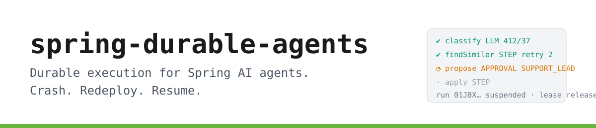

<p align="center">
  <picture>
    <source media="(prefers-color-scheme: dark)" srcset="docs/brand/banner-dark.svg">
    
  </picture>
</p>

<p align="center">
  <a href="https://github.com/bnymnDev/spring-durable-agents/actions/workflows/ci.yml"></a>
  <a href="https://central.sonatype.com/namespace/io.github.bnymndev"></a>
  
  
  
  <a href="LICENSE"></a>
</p>

<p align="center">
  <a href="#introducing-spring-durable-agents">Why</a> ·
  <a href="#see-it-work">Demo</a> ·
  <a href="#60-seconds">Install</a> ·
  <a href="#how-resume-works">How it works</a> ·
  <a href="#compared-with">Compared with</a> ·
  <a href="#documentation">Docs</a>
</p>

---

## Introducing spring-durable-agents

An agent is a loop of expensive, slow, side-effecting calls: ask a model, call a tool, write to a
system, wait for a person. Run it in a plain Spring `@Service` and it works until the pod is
rescheduled halfway through. Then the model is asked again (paid twice), the refund is booked again
(booked twice), and the person who approved step three is asked to approve it again. Nobody wrote a
bug. The process just stopped, and nothing remembered where.

Workflow engines solve this, at the price of becoming your architecture: a server, a worker
protocol, a new vocabulary. Spring AI gives you the model calls but says nothing about what happens
when the JVM dies between two of them.

**spring-durable-agents is the missing middle.** A Spring Boot starter that makes an agent's steps
durable in the database you already have, and otherwise stays out of the way:

| | |
|---|---|
| **Every step is a row** | Each LLM call, tool call and side effect is a step with a deterministic key in PostgreSQL. A completed step never runs again. Crash, redeploy, scale to zero: the next instance replays the history and continues at the first step without a result. |
| **Humans in the loop** | `steps.approval("SUPPORT_LEAD", ofDays(1))` suspends the run and releases the thread. Someone with the role approves through a REST endpoint, a Slack bot or a Modulith event; the run wakes up where it stopped. Rejections and timeouts are first-class. |
| **Boring to operate** | `/actuator/agents` shows every run with its step timeline. Micrometer timers and token counters, one OpenTelemetry span per step with GenAI attributes, `runId` in every log line. A test slice with a scripted model and a crash simulator. |

No proxy on your agent class, no bytecode weaving, no broker, no server. One starter, one
`DataSource`, one interface to implement.

```
  your code                        spring-durable-agents                       PostgreSQL
┌──────────────────────┐      ┌────────────────────────────────┐      ┌───────────────────────┐
│ @DurableAgent        │      │ engine        step store       │      │ agent_run             │
│  run(input, steps) ──┼─────▶│  ├ key   = runId:name:n        │─────▶│ agent_step   (jsonb)  │
│    steps.llm(...)    │      │  ├ replay completed keys       │◀─────│ agent_approval        │
│    steps.run(...)    │◀─────┼  ├ lease + heartbeat + reaper  │      └───────────────────────┘
│    steps.approval()  │      │  └ compensate on failure       │
└──────────┬───────────┘      │ ChatClient advisor  · @Step AOP│      ┌───────────────────────┐
           │ ChatClient       │ approvals REST      · actuator │─────▶│ /actuator/agents      │
           ▼                  └────────────────────────────────┘      │ metrics · spans · MDC │
      Spring AI  ──▶  model, tools, MCP                                └───────────────────────┘
```

---

## See it work

Everything below is recorded by the test suite of this repository (`DurableAgentTestSliceTests`,
`RefundAgentTests`, `RunEngineTests`). The model is the scripted `FakeChatModel`, so the model name
and token counts are its defaults; everything else is the real engine on the in-memory store. Ids are
shortened.

**A run crashes after the model answered. The next instance does not ask again.**

```
INFO  RunEngine  Run 01M1Q8… of agent 'ticket-triage' started
ERROR RunEngine  Run 01M1Q8… crashed; leaving it RUNNING with an expired lease for resume
INFO  RunEngine  Run 01M1Q8… of agent 'ticket-triage' resumed
INFO  RunEngine  Run 01M1Q8… suspended at 01M1Q8…:apply:0: Waiting for approval by SUPPORT_LEAD
```

`agent_step` at that point. The model was called once; the approval is waiting.

| step_key | kind | status | attempt | model | tokens_in | tokens_out |
|---|---|---|---|---|---|---|
| `…:classify:0` | LLM | COMPLETED | 1 | | | |
| `…:classify:0/llm:0` | LLM | COMPLETED | 1 | fake-chat-model | 10 | 5 |
| `…:triageSteps.findSimilar:0` | STEP | COMPLETED | 1 | | | |
| `…:apply:0` | APPROVAL | PENDING_APPROVAL | 0 | | | |

**Finance rejects a refund. The reservation that was already made is undone, once.**

```
step                              kind          status
assess                            LLM           COMPLETED
assess/llm:0                      LLM           COMPLETED      fake-chat-model  10/5
refundSteps.reserve               STEP          COMPLETED      reservation 7c1e…
refundSteps.reserve/sideEffect    SIDE_EFFECT   COMPLETED      reservation:10044
approveRefund                     APPROVAL      FAILED         rejected by finance: no proof
compensate:refundSteps.reserve    COMPENSATION  COMPLETED
```

**The code changed under a running agent. Strict replay says so instead of guessing.**

```
NonDeterministicReplay: Run 01J8XR… diverged from its history at step #0: recorded 'work' but the code
called 'changed'. Recorded sequence: [work, work]. Either the agent code changed in an incompatible way
or it is not deterministic between steps.
```

**A `@Step` on the agent class itself fails at startup, not silently at resume.**

```
BeanCreationException: Error creating bean with name 'triageAgent': @Step methods are not allowed on the
@DurableAgent class com.acme.TriageAgent (found: [classify]). Spring AOP cannot intercept calls a bean
makes to itself, so these steps would silently not be recorded. Move them to a separate @Component and
call that bean from run(), or use steps.run("name", () -> ...) inside the agent.
```

---

## What's in the box

| | |
|---|---|
| **`Steps` API** | `run`, `llm`, `sideEffect`, `retry`, `timeout`, `version`, `compensate`, `approval`. Deterministic keys `runId:name:n`; loops, nesting, lambdas and `final` classes all work because nothing is proxied. |
| **`@Step` on other beans** | Ordinary Spring AOP for beans the agent calls, with `retry`, `timeout` and `compensate` attributes. The generic return type survives replay. Same rule as `@Transactional`, enforced at startup. |
| **Spring AI advisor** | Every `ChatClient` call inside a run is a child step with model, token usage, latency and prompt hash. Tool callbacks and MCP tools are wrapped so a tool executed during an LLM turn is not executed again on resume. |
| **Approvals** | `GET /agents/approvals`, `POST …/{id}/approve`, `…/reject`, role-checked. A Modulith `@Externalized` event per request for Slack, e-mail, Kafka. Timeout policies `FAIL`, `REJECT`, `APPROVE`. |
| **Crash recovery** | Runs execute under a lease with a heartbeat. A reaper resumes runs whose lease expired, on any instance. No broker. |
| **Compensation** | Saga-style undo for completed steps when a run fails later, itself recorded so it never runs twice. |
| **Strict replay** | Opt-in guard that fails a resume whose step sequence diverged from the history, with a readable diff. |
| **Actuator** | `/actuator/agents`, `/actuator/agents/runs/{id}` with the full timeline, a health indicator with stale-lease count. |
| **Metrics and traces** | `agent.step.duration`, `agent.run.duration`, `agent.llm.tokens`, `agent.run.active`, `agent.approval.pending`. One span per run and step, LLM spans with `gen_ai.*` attributes. `runId` and `stepKey` in the MDC. |
| **Test slice** | `@DurableAgentTest` with an in-memory store, `FakeChatModel.respondWithJson(...)`, `crashAfter("step")`, and `assertThatRun(id).completed().hasSteps(...).step("propose").wasApproved()`. |
| **PostgreSQL, H2** | Bundled Flyway migrations in their own history table; `jsonb` inputs and outputs; retention. Or bring your own store through three interfaces. |
| **Virtual threads** | Every run on its own virtual thread; nothing blocks a platform thread waiting for a model. |

---

## Who it is for

- **You build agents with Spring AI** and want them to survive a deploy without paying for the same
  model call twice or booking the same refund twice.
- **You need a human to approve** what an agent proposes before it acts, and you want that to be a
  line of code, not a state machine.
- **You run Spring Boot in production** and expect the usual things: Actuator, Micrometer, slice
  tests, properties, `@ConditionalOnMissingBean`. Not a workflow server next to your application.

---

## 60 seconds

**1.** Add the starter (and the modules you want).

```xml
<dependency>
  <groupId>io.github.bnymndev</groupId>
  <artifactId>durable-agents-starter</artifactId>
  <version>0.1.0</version>
</dependency>
<dependency>
  <groupId>io.github.bnymndev</groupId>
  <artifactId>durable-agents-spring-ai</artifactId>
  <version>0.1.0</version>
</dependency>
```

**2.** Write the agent. Everything non-deterministic goes inside a step; `@Step` methods live on
another bean.

```java
@DurableAgent("ticket-triage")
public class TicketTriageAgent implements Agent<Ticket, Resolution> {

  private final ChatClient chat;
  private final TriageSteps triage;

  public TicketTriageAgent(ChatClient.Builder builder, TriageSteps triage) {
    this.chat = builder.build();
    this.triage = triage;
  }

  @Override
  public Resolution run(Ticket ticket, Steps steps) {
    var c = steps.llm("classify", Classification.class, () ->
        chat.prompt().user(u -> u.text("Classify: {t}").param("t", ticket.body()))
            .call().entity(Classification.class));

    var similar = steps.retry(3, Duration.ofSeconds(2))
        .run("findSimilar", new TypeRef<List<SimilarTicket>>() {}, () -> triage.findSimilar(c));

    var r = steps.approval("SUPPORT_LEAD", Duration.ofDays(1))
        .run("propose", Resolution.class, () -> triage.propose(c, similar));

    steps.run("apply", () -> triage.apply(r));
    return r;
  }
}

@Component
class TriageSteps {
  @Step(retry = @Retry(maxAttempts = 3)) public List<SimilarTicket> findSimilar(Classification c) { ... }
  @Step public Resolution propose(Classification c, List<SimilarTicket> s) { ... }
  @Step public void apply(Resolution r) { ... }
}
```

**3.** Point it at a database and start runs.

```yaml
spring.datasource.url: jdbc:postgresql://localhost:5432/app
spring.threads.virtual.enabled: true
```

```java
RunHandle handle = agentRuns.start(TicketTriageAgent.class, ticket, ticket.id());
```

Kill the process. Start it again. Watch the log:

```
Resumed run 01J8XQ2D… of agent 'ticket-triage' after its lease expired
```

The reference application under [`examples/ticket-triage`](examples/ticket-triage) does exactly
this with Docker Compose and curl, step by step.

---

## How resume works

```
 start()                              crash                          resume() / reaper
 ───────                              ─────                          ─────────────────
 run(input, steps)                                                   run(input, steps)   ← same input
   classify   ── execute ──▶ store                                     classify   ── key exists ──▶ replay (no model call)
   findSimilar── execute ──▶ store                                     findSimilar── key exists ──▶ replay
   propose    ── execute ──▶ store ─── ✕ process dies ───┐             propose    ── key exists ──▶ replay
                                                         │             apply      ── no key     ──▶ execute ──▶ store
              lease_until passes; reaper takes the lease ┘             return r   ──▶ COMPLETED
```

1. Every `steps.*` call computes a key: `runId:name:n` at the top level, `parentKey/name:n` inside another step. `n` counts calls with that name, so loops work.
2. A key that exists as `COMPLETED` returns the stored JSON, decoded into the requested type. The supplier is not executed.
3. A key that does not exist executes the supplier, stores the result, continues.
4. An approval step stores itself as `PENDING_APPROVAL` and throws `RunSuspended`; the engine releases the lease. A decision resumes the run; the supplier runs on resume.
5. A run executes under a lease renewed by a heartbeat. A dead instance stops renewing; the reaper on any instance resumes the run after `lease-duration`.
6. A failure after step N runs the compensations of steps N..1 in reverse, each as a step, then marks the run `FAILED`. `resume()` on a failed run retries from the first step without a result.

The only rule this asks of you: the code between steps has to produce the same step names on every
call. `durable-agents.strict-replay=true` checks that on every resume.

---

## Compared with

| | Spring AI alone | Temporal | DBOS | LangGraph4j | spring-durable-agents |
|---|---|---|---|---|---|
| Survives a crash mid-run | no | yes | yes | with a checkpointer | yes |
| Needs a server or broker | – | Temporal server + workers | DBOS cloud or Conductor | no | no, your PostgreSQL |
| Programming model | plain Java | workflows + activities, own SDK | `@Workflow`/`@Step` on Java | graph of nodes and edges | `Agent.run(input, steps)` |
| Human approval | build it | signals | build it | interrupt | `steps.approval(role, timeout)` + REST |
| LLM calls recorded with tokens | via observation | no | no | no | yes, per call, replayable |
| Tool / MCP calls durable | no | as activities | as steps | no | yes, wrapped automatically |
| Spring Boot integration | native | community | community | community | native: starter, Actuator, slice tests, properties |
| Determinism requirement | – | yes | yes | – | yes, between steps |
| Scope | model access | general workflow engine | general durable execution | agent graphs | durable agents on Spring |

It is not a workflow engine. No DAGs, no BPMN, no multi-node coordination beyond leases, no
streaming yet ([SPEC.md](SPEC.md) lists the non-goals). If you need Temporal, use Temporal.

---

## Design principles

1. **No magic on your class.** The agent is a plain bean; durability goes through an object you are
   handed. Self-invocation, `final`, records, lambdas, GraalVM: nothing to know, nothing to break.
2. **Fail at startup, not at resume.** A `@Step` in the wrong place, a store that cannot be
   configured, a diverged history in strict mode: each is one precise message, early.
3. **Every step is idempotent by key.** `runId:name:n` is computed, not generated. Replay is a
   lookup, never a guess.
4. **Nothing blocks waiting on a model or a human.** Virtual threads for runs; a suspended run
   holds no thread and no lease.
5. **Replace any part.** Every bean is `@ConditionalOnMissingBean`; the store is three interfaces;
   the core depends on `spring-context`, `spring-tx` and JSpecify, nothing else (ArchUnit-enforced).

The reasoning behind each choice is in [DECISIONS.md](DECISIONS.md).

---

## Documentation

| Document | What is in it |
|---|---|
| [docs/getting-started.md](docs/getting-started.md) | Dependencies, the first agent, starting runs, crash and resume, approvals, the first test |
| [docs/programming-model.md](docs/programming-model.md) | Every `Steps` operation, keys, replay, strict replay, `@Step`, approvals, compensation, errors |
| [docs/persistence.md](docs/persistence.md) | Schema, leases and the reaper, retention, transactions, bringing your own store |
| [docs/approvals.md](docs/approvals.md) | Endpoints, authorization, notifications, timeouts |
| [docs/observability.md](docs/observability.md) | Actuator endpoint, health, metrics, traces, MDC, prompt recording |
| [docs/testing.md](docs/testing.md) | `@DurableAgentTest`, `DurableAgentTester`, `FakeChatModel`, assertions, PostgreSQL integration tests |
| [docs/configuration.md](docs/configuration.md) | Every property, every replaceable bean |
| [docs/migration.md](docs/migration.md) | Changing agents with runs in flight, schema upgrades |
| [SPEC.md](SPEC.md) | The v0.1 specification: goals, non-goals, modules, milestones |
| [DECISIONS.md](DECISIONS.md) | Architecture decision records |
| [examples/ticket-triage](examples/ticket-triage) | Reference app: LLM, `@Step`, approval, Docker Compose, curl walkthrough |
| [examples/order-refund](examples/order-refund) | MCP tools through agentgate and shopware-mcp, compensation, Modulith events |

## Modules

| Artifact | Contains |
|---|---|
| `durable-agents-core` | `Agent`, `Steps`, annotations, engine, in-memory store, store and listener SPI. No Spring AI, no Jackson. |
| `durable-agents-store-jdbc` | PostgreSQL and H2 stores, Flyway migrations |
| `durable-agents-spring-ai` | `ChatClient` advisor, durable tool and MCP callbacks |
| `durable-agents-approval` | REST endpoints, security defaults, Modulith event |
| `durable-agents-actuator` | Endpoint, health, metrics, observations, MDC |
| `durable-agents-test` | `@DurableAgentTest`, `FakeChatModel`, crash simulation, assertions |
| `durable-agents-starter` | Autoconfiguration and `durable-agents.*` properties |

## Building from source

```sh
./mvnw verify                                        # all modules, H2 tests; PostgreSQL tests when Docker is present
./mvnw -pl durable-agents-starter test -Dtest=ModuleRulesTests   # the ArchUnit module rules
./mvnw -pl examples/ticket-triage spring-boot:run    # reference app against docker compose up
./mvnw -Prelease deploy                              # sources, javadoc, signatures, Central Portal
```

Java 21, Maven 3.9 (the wrapper fetches it). Docker is optional.

## Status

v0.1.0. Everything in this README is implemented and covered by tests: the engine, both stores, the
Spring AI advisor with tool wrapping, approvals with security, the actuator module, the test slice
and both examples. Not in it, on purpose: multi-node coordination beyond leases, `ChatClient`
streaming, an admin UI (the JSON is there; the UI is v0.2), and any attempt to make a model decide
whether a step is safe.

Roadmap: advisory locks for multi-instance fairness, a small admin UI on top of `/actuator/agents`,
a `RunQuery` by step name and model, and a GraalVM native-image smoke test.

## License

Apache-2.0 — see [LICENSE](LICENSE).

<p align="center"><sub>If a redeploy ever asked your model the same question twice, a star helps the next person find this.</sub></p>
