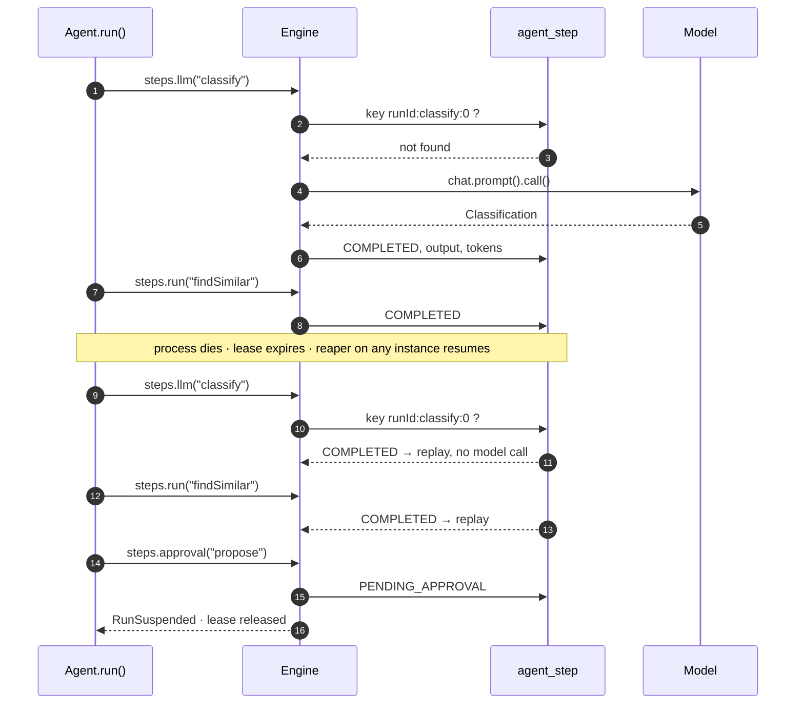

<p align="center">
  <picture>
    <source media="(prefers-color-scheme: dark)" srcset="docs/brand/banner-dark.svg">
    
  </picture>
</p>

<h3 align="center">Durable execution for Spring AI agents.<br>Crash. Redeploy. Resume.</h3>

<p align="center">
  <a href="https://github.com/bnymnDev/spring-durable-agents/actions/workflows/ci.yml"></a>
  <a href="https://github.com/bnymnDev/spring-durable-agents/releases/latest"></a>
  <a href="https://central.sonatype.com/namespace/io.github.bnymndev"></a>
  <a href="https://jitpack.io/#bnymnDev/spring-durable-agents"></a>
  
  
  
  <a href="LICENSE"></a>
</p>

<p align="center">
  <a href="#why">Why</a> &nbsp;·&nbsp;
  <a href="#quick-start">Quick start</a> &nbsp;·&nbsp;
  <a href="#how-it-works">How it works</a> &nbsp;·&nbsp;
  <a href="#features">Features</a> &nbsp;·&nbsp;
  <a href="#see-it-work">Demo</a> &nbsp;·&nbsp;
  <a href="#comparison">Comparison</a> &nbsp;·&nbsp;
  <a href="#documentation">Docs</a> &nbsp;·&nbsp;
  <a href="#community">Community</a>
</p>

<br>

```java
@DurableAgent("ticket-triage")
public class TicketTriageAgent implements Agent<Ticket, Resolution> {

  @Override
  public Resolution run(Ticket ticket, Steps steps) {
    var c = steps.llm("classify", Classification.class, () -> chat.prompt()          // 1  LLM call, recorded once
        .user(u -> u.text("Classify: {t}").param("t", ticket.body()))
        .call().entity(Classification.class));

    var similar = steps.retry(3, ofSeconds(2))                                       // 2  retried, persisted attempts
        .run("findSimilar", new TypeRef<List<SimilarTicket>>() {}, () -> triage.findSimilar(c));

    var r = steps.approval("SUPPORT_LEAD", ofDays(1))                                // 3  human decides, thread released
        .run("propose", Resolution.class, () -> triage.propose(c, similar));

    steps.run("apply", () -> triage.apply(r));                                       // 4  side effect, exactly once
    return r;
  }
}
```

Kill the JVM anywhere in that method. Start it again. The run continues at the first step without a
result; the model is not asked twice, the resolution is not applied twice, the lead is not asked twice.

<br>

## Why

An agent is a loop of expensive, slow, side-effecting calls: ask a model, call a tool, write to a
system, wait for a person. Put that in a plain Spring `@Service` and it works until the pod is
rescheduled halfway through. Then the model is asked again (paid twice), the refund is booked again
(booked twice), and the person who approved step three is asked to approve it again. Nobody wrote a
bug. The process stopped, and nothing remembered where.

Workflow engines solve this at the price of becoming your architecture: a server, a worker protocol,
a new vocabulary. Spring AI gives you the model calls but says nothing about what happens when the
JVM dies between two of them.

**spring-durable-agents is the missing middle.** A Spring Boot starter that makes an agent's steps
durable in the database you already have, and otherwise stays out of the way.

<table>
<tr>
<td width="33%" valign="top">

**🧱 Every step is a row**

Each LLM call, tool call and side effect is a step with a deterministic key in PostgreSQL. A
completed step never runs again. Crash, redeploy, scale to zero: the next instance replays the
history and continues where it stopped.

</td>
<td width="33%" valign="top">

**🙋 Humans in the loop**

`steps.approval("SUPPORT_LEAD", ofDays(1))` suspends the run and releases the thread. Someone with
the role approves through REST, a Slack bot or a Modulith event; the run wakes up where it stopped.
Rejections and timeouts are first-class.

</td>
<td width="33%" valign="top">

**📈 Boring to operate**

`/actuator/agents` shows every run with its step timeline. Micrometer timers and token counters, one
OpenTelemetry span per step with GenAI attributes, `runId` in every log line. A test slice with a
scripted model and a crash simulator.

</td>
</tr>
</table>

No proxy on your agent class, no bytecode weaving, no broker, no server. One starter, one
`DataSource`, one interface to implement.

<br>

## Quick start

### Requirements

| | |
|---|---|
| Java | 21 or later (virtual threads on) |
| Spring Boot | 4.1 |
| Spring AI | 2.0 (optional, for the `ChatClient` advisor) |
| Database | PostgreSQL 14+ in production, H2 for tests. Or bring your own store. |

### Getting it

All modules share the group `io.github.bnymndev`. Import the BOM once and leave the versions off:

```xml
<dependencyManagement>
  <dependencies>
    <dependency>
      <groupId>io.github.bnymndev</groupId>
      <artifactId>durable-agents-bom</artifactId>
      <version>0.1.1</version>
      <type>pom</type>
      <scope>import</scope>
    </dependency>
  </dependencies>
</dependencyManagement>

<dependencies>
  <dependency>
    <groupId>io.github.bnymndev</groupId>
    <artifactId>durable-agents-starter</artifactId>
  </dependency>
  <dependency>
    <groupId>io.github.bnymndev</groupId>
    <artifactId>durable-agents-spring-ai</artifactId>
  </dependency>
  <dependency>
    <groupId>io.github.bnymndev</groupId>
    <artifactId>durable-agents-test</artifactId>
    <scope>test</scope>
  </dependency>
</dependencies>
```

Gradle:

```kotlin
implementation(platform("io.github.bnymndev:durable-agents-bom:0.1.1"))
implementation("io.github.bnymndev:durable-agents-starter")
implementation("io.github.bnymndev:durable-agents-spring-ai")
testImplementation("io.github.bnymndev:durable-agents-test")
```

<details>
<summary><b>Repositories: Maven Central, GitHub Packages, JitPack</b></summary>
<br>

Releases go to Maven Central. Every tag is also on **GitHub Packages** (needs a token with
`read:packages`):

```xml
<repository>
  <id>github</id>
  <url>https://maven.pkg.github.com/bnymnDev/spring-durable-agents</url>
</repository>
```

and on **JitPack**, tokenless, under a different group:

```xml
<repository><id>jitpack</id><url>https://jitpack.io</url></repository>

<dependency>
  <groupId>com.github.bnymnDev.spring-durable-agents</groupId>
  <artifactId>durable-agents-starter</artifactId>
  <version>v0.1.1</version>
</dependency>
```

</details>

### Configure

```yaml
spring:
  datasource:
    url: jdbc:postgresql://localhost:5432/app
  threads:
    virtual:
      enabled: true          # runs execute on virtual threads; nothing blocks waiting on a model
durable-agents:
  strict-replay: true        # recommended in tests and staging
```

The schema installs itself through bundled Flyway migrations with a private history table. No
database at hand? `durable-agents.store: memory`.

### Write the agent

The agent is a plain bean implementing `Agent<I, O>`. Two rules, both enforced at startup:

1. **Everything non-deterministic goes inside a step.** LLM calls, HTTP, `Instant.now()`, random ids.
   The code between steps runs again on every resume and must produce the same sequence of step names.
2. **`@Step` methods live on a bean other than the agent.** Same rule as `@Transactional`: Spring AOP
   cannot intercept a bean calling itself. The starter refuses to boot otherwise.

```java
@Component
class TriageSteps {
  @Step(retry = @Retry(maxAttempts = 3))
  public List<SimilarTicket> findSimilar(Classification c) { ... }   // generic return type survives replay

  @Step(compensate = "unapply")
  public void apply(Resolution r) { ... }                              // undone if the run fails later
  public void unapply(Resolution r) { ... }
}
```

### Start runs, decide approvals

```java
RunHandle handle = agentRuns.start(TicketTriageAgent.class, ticket, ticket.id());
```

```sh
curl -u lead:secret localhost:8080/agents/approvals
curl -u lead:secret -X POST localhost:8080/agents/approvals/{id}/approve -d '{"comment":"ok"}' -H 'content-type: application/json'
```

### Test it

```java
@DurableAgentTest
class TicketTriageAgentTests {
  @Autowired DurableAgentTester agents;
  @Autowired FakeChatModel chat;

  @Test
  void resumesAfterCrash() {
    chat.respondWithJson(new Classification("billing", NORMAL, "wrong VAT"));
    agents.crashAfter("classify");

    RunResult crashed = agents.run(TicketTriageAgent.class, ticket);
    RunResult suspended = agents.resume(crashed.runId());
    RunResult done = agents.approve(crashed.runId(), "lead");

    agents.assertThatRun(done).completed().hasSteps("classify", "findSimilar", "propose", "apply")
        .step("propose").wasApproved();
    assertThat(chat.calls()).isEqualTo(1);       // replayed, not repeated
  }
}
```

No database, no Docker, no API key. The full walkthrough is in
[docs/getting-started.md](docs/getting-started.md); a runnable version with PostgreSQL, Docker
Compose and curl is [`examples/ticket-triage`](examples/ticket-triage).

<br>

## How it works



1. Every `steps.*` call computes a key: `runId:name:n` at the top level, `parentKey/name:n` inside another step. `n` counts calls with that name, so loops work.
2. A key stored as `COMPLETED` returns its JSON, decoded into the requested type. The supplier does not run.
3. A missing key runs the supplier, stores the result and continues.
4. An approval step stores itself as `PENDING_APPROVAL`, publishes an event and throws `RunSuspended`; the engine releases the lease. A decision resumes the run and the supplier runs then.
5. Runs execute under a lease renewed by a heartbeat. A dead instance stops renewing; a reaper on any instance resumes the run after `lease-duration`.
6. A failure after step N runs the compensations of steps N..1 in reverse, each as a step, then marks the run `FAILED`. `resume()` on a failed run retries from the first step without a result.

The one rule this asks of you: the code between steps produces the same step names on every call.
`durable-agents.strict-replay=true` checks it on every resume and names the exact position where
code and history diverged.

```
  your code                        spring-durable-agents                       PostgreSQL
┌──────────────────────┐      ┌────────────────────────────────┐      ┌───────────────────────┐
│ @DurableAgent        │      │ engine        step store       │      │ agent_run             │
│  run(input, steps) ──┼─────▶│  ├ key   = runId:name:n        │─────▶│ agent_step   (jsonb)  │
│    steps.llm(...)    │      │  ├ replay completed keys       │◀─────│ agent_approval        │
│    steps.run(...)    │◀─────┼  ├ lease + heartbeat + reaper  │      └───────────────────────┘
│    steps.approval()  │      │  └ compensate on failure       │
└──────────┬───────────┘      │ ChatClient advisor  · @Step AOP│      ┌───────────────────────┐
           │ ChatClient       │ approvals REST      · actuator │─────▶│ /actuator/agents      │
           ▼                  └────────────────────────────────┘      │ metrics · spans · MDC │
      Spring AI  ──▶  model, tools, MCP                                └───────────────────────┘
```

<br>

## Features

| | |
|---|---|
| **`Steps` API** | `run`, `llm`, `sideEffect`, `retry`, `timeout`, `version`, `compensate`, `approval`. Deterministic keys; loops, nesting, lambdas and `final` classes all work because nothing is proxied. |
| **`@Step` on other beans** | Ordinary Spring AOP with `retry`, `timeout` and `compensate` attributes. The generic return type survives replay. Same rule as `@Transactional`, enforced at startup. |
| **Spring AI advisor** | Every `ChatClient` call inside a run is a child step with model, token usage, latency and prompt hash, replayable without the model. Tool callbacks and MCP tools are wrapped so a tool executed during an LLM turn is not executed again on resume. |
| **Approvals** | `GET /agents/approvals`, `POST …/{id}/approve`, `…/reject`, role-checked. A Modulith `@Externalized` event per request for Slack, e-mail, Kafka. Timeout policies `FAIL`, `REJECT`, `APPROVE`. |
| **Crash recovery** | Runs execute under a lease with a heartbeat. A reaper resumes runs whose lease expired, on any instance. No broker. |
| **Compensation** | Saga-style undo for completed steps when a run fails later, itself recorded so it never runs twice. |
| **Strict replay** | Opt-in guard that fails a resume whose step sequence diverged from the history, with a readable diff. |
| **Actuator** | `/actuator/agents`, `/actuator/agents/runs/{id}` with the full timeline, a health indicator with stale-lease count. |
| **Metrics and traces** | `agent.step.duration`, `agent.run.duration`, `agent.llm.tokens`, `agent.run.active`, `agent.approval.pending`. One span per run and step; LLM spans carry `gen_ai.*` attributes. `runId` and `stepKey` in the MDC. |
| **Test slice** | `@DurableAgentTest`, `FakeChatModel.respondWithJson(...)`, `crashAfter("step")`, `assertThatRun(id).completed().hasSteps(...).step("propose").wasApproved()`. |
| **PostgreSQL, H2** | Bundled Flyway migrations in their own history table; `jsonb` inputs and outputs; retention. Or bring your own store through three interfaces. |
| **Virtual threads** | Every run on its own virtual thread; nothing blocks a platform thread waiting for a model. |

### Modules

| Artifact | Contains |
|---|---|
| `durable-agents-bom` | Pins all modules to one version |
| `durable-agents-starter` | Autoconfiguration and `durable-agents.*` properties |
| `durable-agents-core` | `Agent`, `Steps`, annotations, engine, in-memory store, store and listener SPI. No Spring AI, no Jackson. |
| `durable-agents-store-jdbc` | PostgreSQL and H2 stores, Flyway migrations |
| `durable-agents-spring-ai` | `ChatClient` advisor, durable tool and MCP callbacks |
| `durable-agents-approval` | REST endpoints, security defaults, Modulith event |
| `durable-agents-actuator` | Endpoint, health, metrics, observations, MDC |
| `durable-agents-test` | `@DurableAgentTest`, `FakeChatModel`, crash simulation, assertions |

<br>

## See it work

Everything below is recorded by the test suite of this repository (`DurableAgentTestSliceTests`,
`RefundAgentTests`, `RunEngineTests`). The model is the scripted `FakeChatModel`, so model name and
token counts are its defaults; the rest is the real engine. Ids are shortened.

**A run crashes after the model answered. The next instance does not ask again.**

```
INFO  RunEngine  Run 01M1Q8… of agent 'ticket-triage' started
ERROR RunEngine  Run 01M1Q8… crashed; leaving it RUNNING with an expired lease for resume
INFO  RunEngine  Run 01M1Q8… of agent 'ticket-triage' resumed
INFO  RunEngine  Run 01M1Q8… suspended at 01M1Q8…:apply:0: Waiting for approval by SUPPORT_LEAD
```

| step_key | kind | status | attempt | model | tokens_in | tokens_out |
|---|---|---|---|---|---|---|
| `…:classify:0` | LLM | COMPLETED | 1 | | | |
| `…:classify:0/llm:0` | LLM | COMPLETED | 1 | fake-chat-model | 10 | 5 |
| `…:triageSteps.findSimilar:0` | STEP | COMPLETED | 1 | | | |
| `…:apply:0` | APPROVAL | PENDING_APPROVAL | 0 | | | |

**Finance rejects a refund. The reservation that was already made is undone, once.**

```
step                              kind          status
assess                            LLM           COMPLETED
assess/llm:0                      LLM           COMPLETED      fake-chat-model  10/5
refundSteps.reserve               STEP          COMPLETED      reservation 7c1e…
refundSteps.reserve/sideEffect    SIDE_EFFECT   COMPLETED      reservation:10044
approveRefund                     APPROVAL      FAILED         rejected by finance: no proof
compensate:refundSteps.reserve    COMPENSATION  COMPLETED
```

**The code changed under a running agent. Strict replay says so instead of guessing.**

```
NonDeterministicReplay: Run 01J8XR… diverged from its history at step #0: recorded 'work' but the code
called 'changed'. Recorded sequence: [work, work]. Either the agent code changed in an incompatible way
or it is not deterministic between steps.
```

**A `@Step` on the agent class itself fails at startup, not silently at resume.**

```
BeanCreationException: @Step methods are not allowed on the @DurableAgent class com.acme.TriageAgent
(found: [classify]). Spring AOP cannot intercept calls a bean makes to itself, so these steps would
silently not be recorded. Move them to a separate @Component and call that bean from run(), or use
steps.run("name", () -> ...) inside the agent.
```

<br>

## Comparison

| | Spring AI alone | Temporal | DBOS | LangGraph4j | **spring-durable-agents** |
|---|:-:|:-:|:-:|:-:|:-:|
| Survives a crash mid-run | – | ✔ | ✔ | with a checkpointer | ✔ |
| Needs a server or broker | – | server + workers | cloud or Conductor | – | **no, your PostgreSQL** |
| Programming model | plain Java | workflows + activities | `@Workflow`/`@Step` | graph of nodes | `Agent.run(input, steps)` |
| Human approval | build it | signals | build it | interrupt | `steps.approval(role, timeout)` + REST |
| LLM calls recorded with tokens | via observation | – | – | – | ✔ per call, replayable |
| Tool / MCP calls durable | – | as activities | as steps | – | ✔ wrapped automatically |
| Spring Boot integration | native | community | community | community | **native**: starter, Actuator, slice tests |
| Determinism between steps | – | required | required | – | required |
| Scope | model access | general workflow engine | general durable execution | agent graphs | durable agents on Spring |

It is not a workflow engine. No DAGs, no BPMN, no multi-node coordination beyond leases, no
streaming yet ([SPEC.md](SPEC.md) lists the non-goals). If you need Temporal, use Temporal.

<br>

## Design principles

1. **No magic on your class.** The agent is a plain bean; durability goes through an object you are handed. Self-invocation, `final`, records, lambdas, GraalVM: nothing to know, nothing to break.
2. **Fail at startup, not at resume.** A `@Step` in the wrong place, a store that cannot be configured, a diverged history in strict mode: each is one precise message, early.
3. **Every step is idempotent by key.** `runId:name:n` is computed, not generated. Replay is a lookup, never a guess.
4. **Nothing blocks waiting on a model or a human.** Virtual threads for runs; a suspended run holds no thread and no lease.
5. **Replace any part.** Every bean is `@ConditionalOnMissingBean`; the store is three interfaces; the core depends on `spring-context`, `spring-tx` and JSpecify, nothing else (ArchUnit-enforced).

The reasoning behind each choice is in [DECISIONS.md](DECISIONS.md).

<br>

## Documentation

| Document | What is in it |
|---|---|
| [Getting started](docs/getting-started.md) | Dependencies, the first agent, starting runs, crash and resume, approvals, the first test |
| [Programming model](docs/programming-model.md) | Every `Steps` operation, keys, replay, strict replay, `@Step`, approvals, compensation, errors |
| [Persistence](docs/persistence.md) | Schema, leases and the reaper, retention, transactions, bringing your own store |
| [Approvals](docs/approvals.md) | Endpoints, authorization, notifications, timeouts |
| [Observability](docs/observability.md) | Actuator endpoint, health, metrics, traces, MDC, prompt recording |
| [Testing](docs/testing.md) | `@DurableAgentTest`, `DurableAgentTester`, `FakeChatModel`, assertions, PostgreSQL integration tests |
| [Configuration](docs/configuration.md) | Every property, every replaceable bean |
| [Migration notes](docs/migration.md) | Changing agents with runs in flight, schema upgrades |
| [SPEC.md](SPEC.md) · [DECISIONS.md](DECISIONS.md) | The v0.1 specification and the architecture decision records |
| [examples/ticket-triage](examples/ticket-triage) | Reference app: LLM, `@Step`, approval, Docker Compose, curl walkthrough |
| [examples/order-refund](examples/order-refund) | MCP tools through [agentgate](https://github.com/bnymnDev/agentgate) and [shopware-mcp](https://github.com/bnymnDev/shopware-mcp), compensation, Modulith events |

<br>

## Building from source

```sh
./mvnw verify                                                    # all modules; PostgreSQL tests run when Docker is present
./mvnw -pl durable-agents-starter test -Dtest=ModuleRulesTests   # ArchUnit module rules
./mvnw -pl examples/ticket-triage spring-boot:run                # reference app against docker compose up
```

Java 21 and Maven 3.9 (the wrapper fetches it). Docker is optional. Releases are cut by the
[release workflow](.github/workflows/release.yml): GitHub release with jars and checksums, GitHub
Packages, Maven Central through the Central Portal.

## Community

- **Questions and ideas**: [GitHub Discussions](https://github.com/bnymnDev/spring-durable-agents/discussions)
- **Bugs**: [Issues](https://github.com/bnymnDev/spring-durable-agents/issues), with the step timeline from `/actuator/agents/runs/{id}` when you have one
- **Security**: see [SECURITY.md](SECURITY.md)
- **Contributing**: [CONTRIBUTING.md](CONTRIBUTING.md) has the ground rules; decisions with alternatives get an ADR first
- **Changes**: [CHANGELOG.md](CHANGELOG.md)

## Status and roadmap

**0.1.x** — everything in this README is implemented and covered by tests: the engine, both stores,
the Spring AI advisor with tool wrapping, approvals with security, the actuator module, the test slice
and both examples. Not in it, on purpose: multi-node coordination beyond leases, `ChatClient`
streaming, an admin UI, and any attempt to make a model decide whether a step is safe.

**Next** — advisory locks for multi-instance fairness, a small admin UI on top of `/actuator/agents`,
`RunQuery` by step name and model, a GraalVM native-image smoke test.

## License

Apache-2.0 — see [LICENSE](LICENSE).

<p align="center"><sub>If a redeploy ever asked your model the same question twice, a star helps the next person find this.</sub></p>
